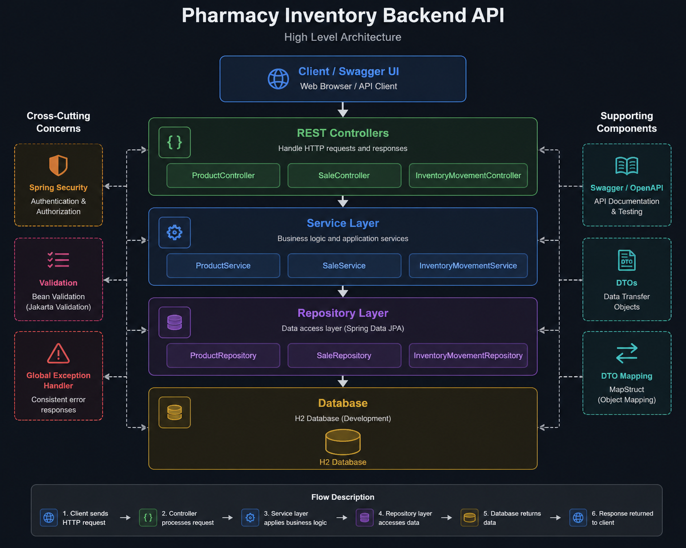
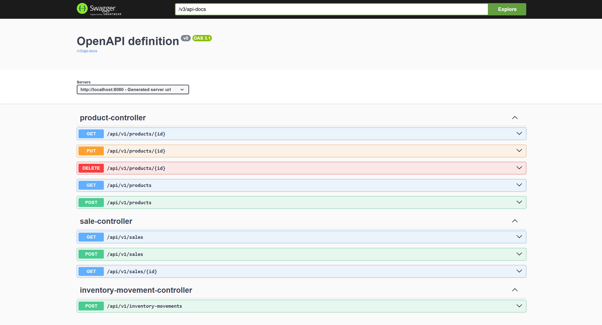
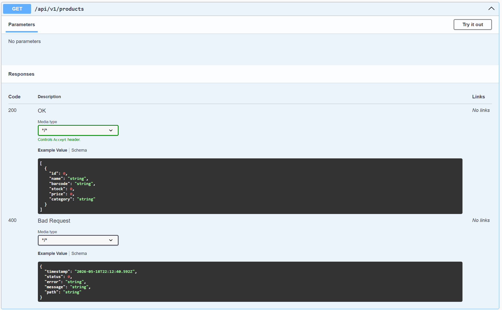
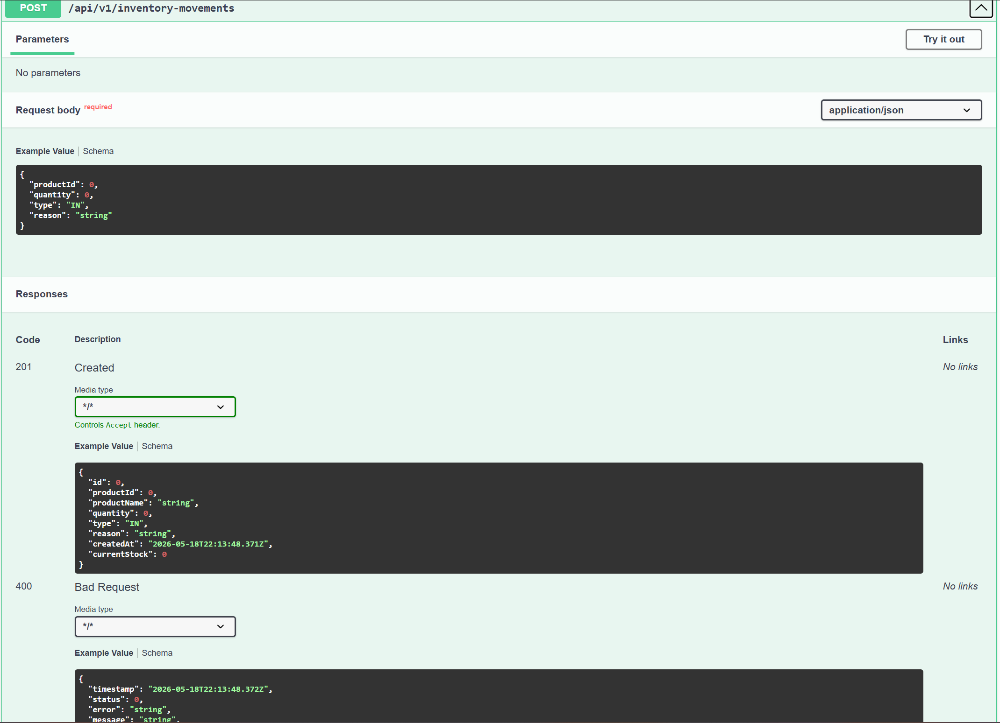
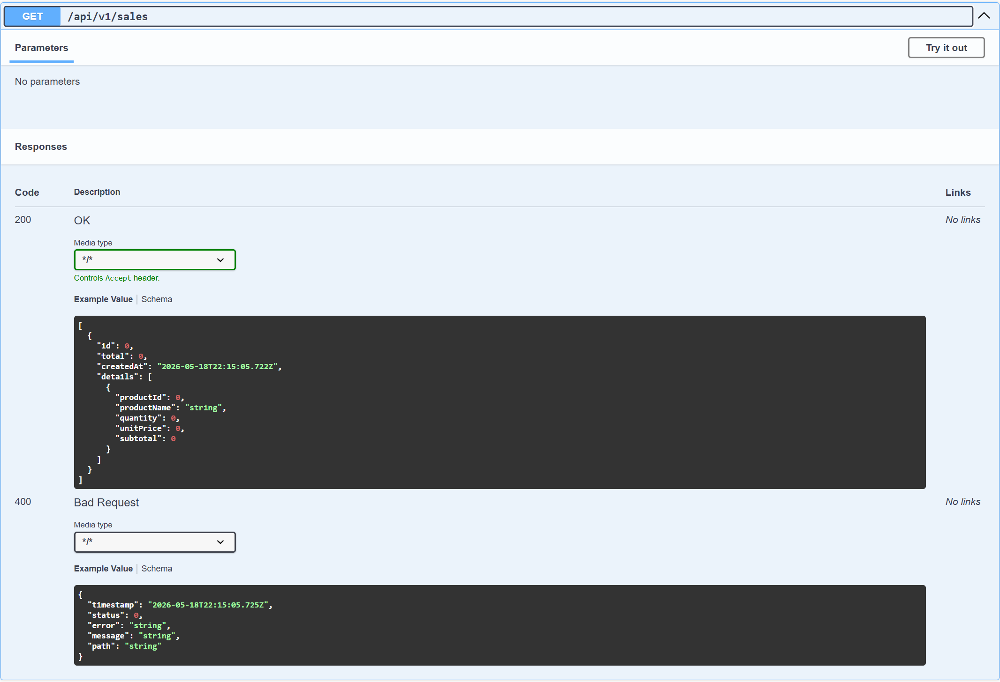

# Pharmacy Inventory Backend API

Professional backend API for pharmacy inventory, sales management, stock control, and reporting.

## Tech Stack

- Java 21
- Spring Boot
- Spring Security
- Spring Data JPA
- H2 Database
- Gradle
- Swagger / OpenAPI
- Lombok

---

## Features

### Product Management
- Create products
- Update products
- Delete products
- Get products
- Barcode validation

### Inventory Management
- Inventory IN movements
- Inventory OUT movements
- Automatic stock updates
- Stock validation

### Sales Management
- Create sales
- Multiple sale items
- Automatic total calculation
- Automatic stock reduction

### Validation & Error Handling
- Global exception handling
- Request validation
- Clean API responses

---

## API Documentation

Swagger UI:

```text
http://localhost:8080/swagger-ui/index.html
```

### Project Structure
```text
controller/
service/
repository/
entity/
dto/
mapper/
security/
exception/
```
## Architecture Diagram



## Running the Project without Docker

### Clone repository
```bash
git clone https://github.com/AndreSPy1/pharmacy-inventory-backend.git
```

### Run application
```bash
./gradlew bootRun
```

## Docker

### Build the application

```bash
./gradlew clean build
```

### Build Docker image

```bash
docker build -t pharmacy-inventory-backend .
```

### Run with Docker

```bash
docker run -p 8080:8080 pharmacy-inventory-backend
```

### Run with Docker Compose

```bash
docker compose up --build
```

The API will be available at:

```text
http://localhost:8080
```

## API Examples

### Create Product

POST `/api/v1/products`

Request:

```json
{
  "name": "Ibuprofen",
  "barcode": "770999111",
  "stock": 100,
  "price": 12000,
  "category": "Pain Relief"
}
```

---

### Register Inventory Movement

POST `/api/v1/inventory-movements`

Request:

```json
{
  "productId": 1,
  "quantity": 20,
  "type": "IN",
  "reason": "Supplier delivery"
}
```

---

### Create Sale

POST `/api/v1/sales`

Request:

```json
{
  "items": [
    {
      "productId": 1,
      "quantity": 2
    }
  ]
}
```

## Screenshots

### Swagger UI



---

### Products API



---

### Inventory API



---

### Sales API



### Author
Andres Peña  
Senior Java Backend Engineer